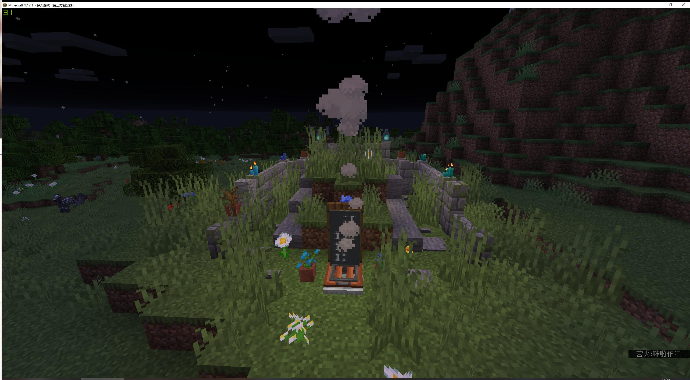
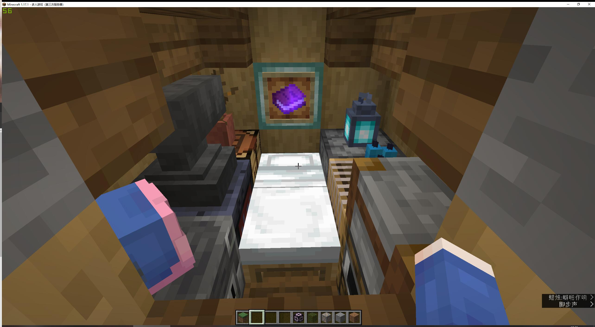
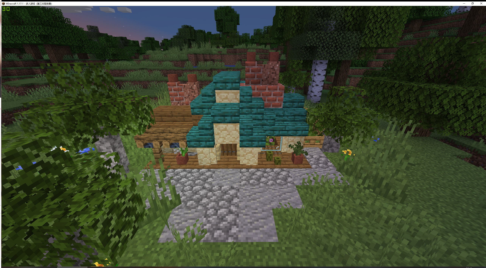
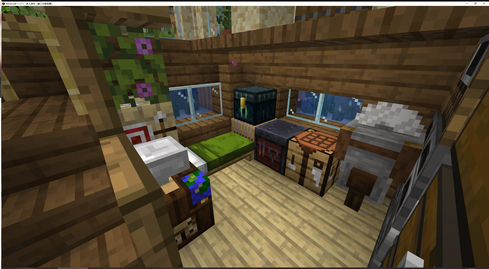

# Minecraft 建筑收藏

> 欢迎加入我们的服务器（正版验证）：`mc.yueplus.ink:25565` 以及 [QQ 群（539436053）](https://jq.qq.com/?_wv=1027&k=RV3sbBi1)

## 使用方式

使用 [Git](https://git-scm.com/) 克隆本仓库：

```
git clone https://github.com/Yue-plus/MinecraftArchitecturalCollection.git
```

参考 [目录](#目录) 将 `structures` 目录中对应的 `.nbt` 文件，复制到游戏存档的 `\generated\minecraft\structures` 目录中。

然后在游戏内使用 [结构方块](https://minecraft.fandom.com/zh/wiki/结构方块) 加载结构。

## 目录

### AC000 - 《永 远 的 家 V2.0》

- 来源：[永 远 的 家 V2.0_单机游戏热门视频](https://www.bilibili.com/video/BV1744y1x7T2)
- 文件：`./structures/forever_home_v2.0.nbt`
- 版本：`1.17.1`
- 预览：
  + 
  + 

### AC001 - 《勉 强 能 住》

- 来源：[勉 强 能 住_单机游戏热门视频](https://www.bilibili.com/video/BV1aq4y197U9)
- 文件：`./structures/barely_able_to_live.nbt`
- 版本：`1.17.1`
- 预览：
  + 
  + 
